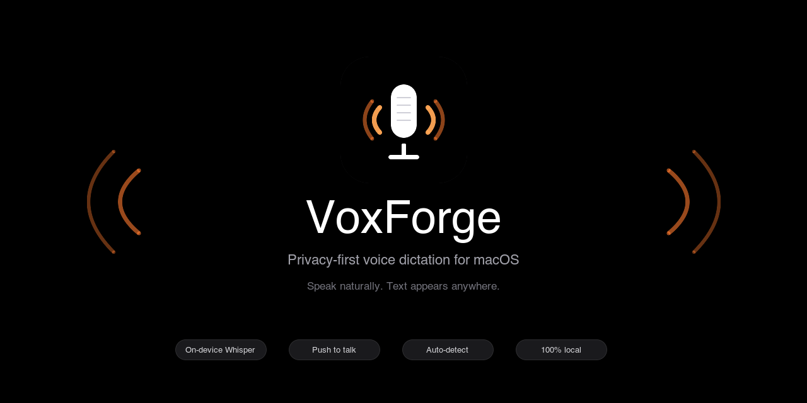
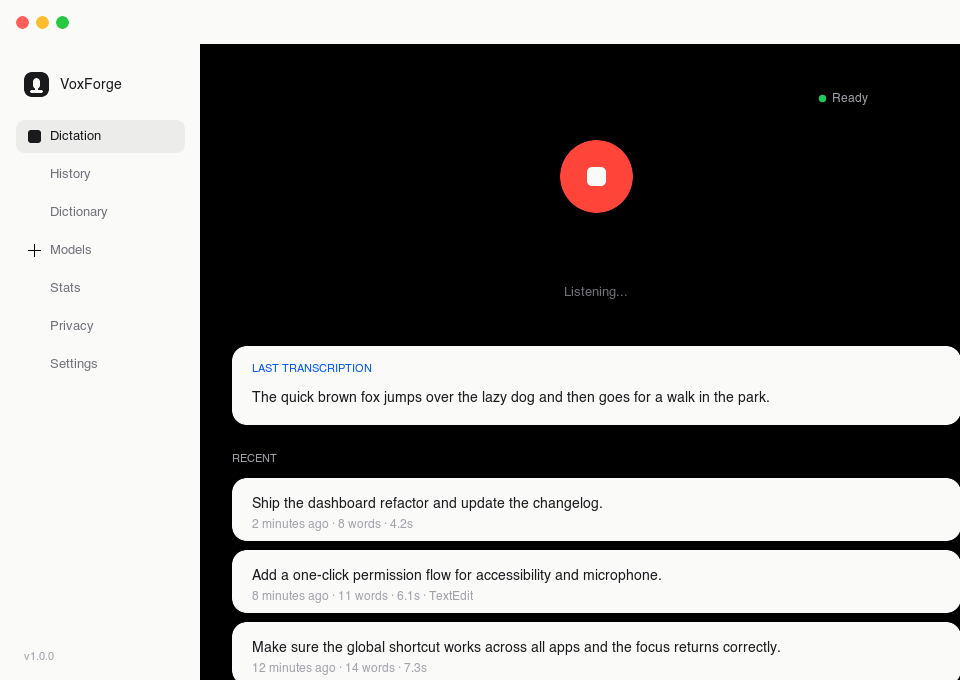
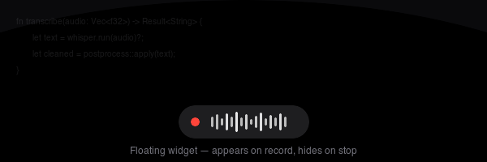
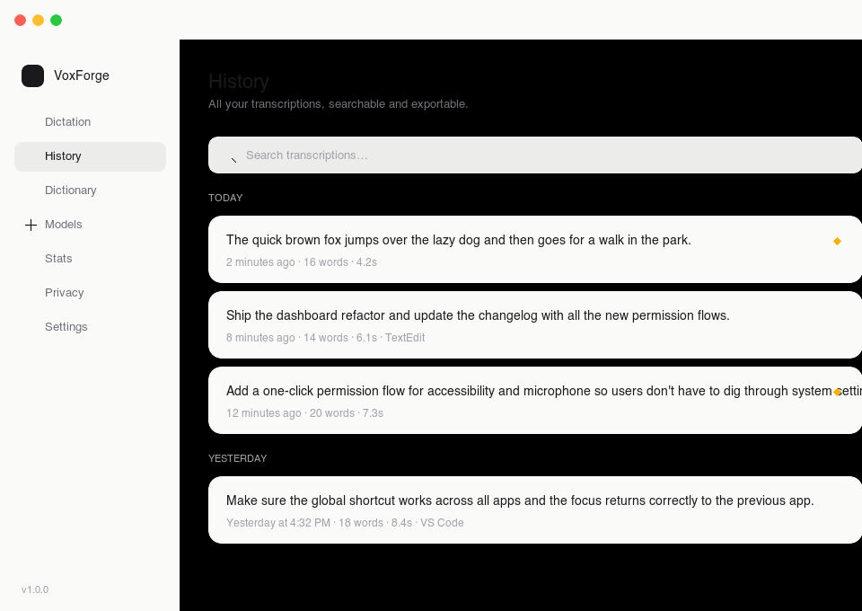

<p align="center">
  
</p>

<p align="center">
  <a href="https://github.com/INDAR-Beurre/voxforge/releases/latest"></a>
  
  
  
  
</p>

<p align="center">
  <strong>Privacy-first voice dictation for macOS and Windows.</strong><br>
  Hold a key, speak, release — text appears in any focused app. No cloud. No tracking. Just your voice, on your machine.
</p>

<p align="center">
  <a href="#install">Install</a> ·
  <a href="#features">Features</a> ·
  <a href="#screenshots">Screenshots</a> ·
  <a href="#architecture">Architecture</a> ·
  <a href="#development">Development</a> ·
  <a href="CHANGELOG.md">Changelog</a>
</p>

---

## Install

### macOS

Download the latest `.dmg` from the [Releases page](https://github.com/INDAR-Beurre/voxforge/releases/latest), drag `VoxForge.app` into `/Applications`, and launch it. On first run, macOS will ask for **Microphone** and **Accessibility** access — both can be granted in one click from the Dashboard.

> **Note:** VoxForge is unsigned for now, so you may need to right-click → Open the first time. The full source builds reproducibly from this repo.

### Windows

Download the latest `.msi` or `.exe` installer from the [Releases page](https://github.com/INDAR-Beurre/voxforge/releases/latest) and run it. Windows Defender SmartScreen may show a warning since the app is unsigned — click "More info" then "Run anyway".

## What is VoxForge?

VoxForge is a push-to-talk voice dictation app for macOS and Windows. It runs Whisper locally to transcribe your speech, then pastes the result into whatever app has focus — code editors, terminals, browsers, chat apps, notes. **Audio never leaves your machine.** Optional cloud endpoints (OpenAI-compatible) are available if you want them, but the default is fully offline.

## Features

- 🎙️ **Push-to-talk** — hold a key, speak, release. A floating widget shows the live waveform while you record.
- 🔒 **100% local** — Whisper runs on-device. No audio is uploaded unless you explicitly opt into a cloud endpoint.
- 🌍 **Auto language detection** — speak English, French, German, Spanish, Japanese, Chinese, Korean, or Portuguese; Whisper figures it out.
- ⚡ **Fast & lightweight** — native Tauri 2 shell, no Electron. The Tauri binary is ~12 MB.
- 📝 **Custom dictionary** — add technical terms, camelCase identifiers, abbreviations, and names.
- 🧹 **Post-processing** — capitalization, filler-word removal, punctuation cleanup.
- 🔁 **Universal injection** — types into any focused app via clipboard + keyboard simulation.
- 📚 **Searchable history** — every transcription saved locally in SQLite. Star, re-inject, export.
- 📊 **Usage analytics** — words per day, total duration, WPM. All stored locally.
- 🔐 **Privacy center** — clear explanation of what stays on your machine.
- 🎛️ **Per-app profiles** — different injection behaviour for code editors, terminals, and chat.
- 💻 **Cross-platform** — works on macOS (Intel & Apple Silicon) and Windows 10/11.

## Screenshots

### Dictation

The Dashboard is where you spend most of your time. One big button, a live waveform while recording, and your last transcription right above recent history.

<p align="center">
  
</p>

### Floating widget

A subtle dark pill that appears at the bottom of your screen while you record. Disappears the moment you release the hotkey. Never steals focus from the app you're typing into.

<p align="center">
  
</p>

### History

Every transcription is saved with a timestamp, word count, duration, and the app that was focused when you dictated. Search, star, re-inject, or export.

<p align="center">
  
</p>

## Tech stack

| Layer | Tech | Why |
| --- | --- | --- |
| Shell | [Tauri 2](https://tauri.app) | Native binary, tiny footprint, Rust backend |
| UI | [React 19](https://react.dev) + [TypeScript](https://www.typescriptlang.org) + [Vite](https://vitejs.dev) | Familiar, fast HMR |
| State | [Zustand](https://github.com/pmndrs/zustand) | Minimal, no boilerplate |
| Styling | Tailwind + design tokens | Tight, consistent visual system |
| Backend | Rust (audio capture, file I/O, IPC) | Performance + safety |
| ASR | [whisper.cpp](https://github.com/ggerganov/whisper.cpp) (via `whisper-rs`) | Best open-source speech-to-text |
| Audio | [cpal](https://github.com/RustAudio/cpal) | Cross-platform audio I/O |
| Storage | SQLite (via `rusqlite`) | Embedded, no server needed |
| Injection | Clipboard + keyboard simulation | Universal, app-agnostic |

## Requirements

### macOS
- macOS **11 Big Sur** or later
- Apple Silicon (recommended) or Intel
- ~200 MB disk for a Whisper model (Base). 3 GB+ for Large-v3
- Microphone permission
- Accessibility permission (for global shortcuts and text injection)

### Windows
- Windows **10** or **11**
- x64 processor
- ~200 MB disk for a Whisper model (Base). 3 GB+ for Large-v3
- Microphone permission

## Keyboard shortcuts

| Shortcut | Action |
| --- | --- |
| `Ctrl + Shift + S` | **Push-to-talk** — hold to record, release to transcribe & inject |
| `fn` / Globe (macOS only) | Push-to-talk (requires Accessibility permission) |
| `⌘ + Q` (macOS) / `Alt + F4` (Windows) | Quit VoxForge |
| `⌘ + W` (macOS) / `Ctrl + W` (Windows) | Close the main window (app stays in tray) |

## Architecture

```
voxforge/
├── src/                      # React + TypeScript frontend
│   ├── components/           # Reusable UI: RecordButton, FloatingWidget, etc.
│   ├── pages/                # Route-level views: Dashboard, History, Settings, ...
│   ├── stores/               # Zustand state: recording, history, theme, ...
│   ├── hooks/                # useGlobalShortcut, useAudioLevel, ...
│   └── styles/               # Tailwind + design tokens
├── src-tauri/                # Rust backend
│   └── src/
│       ├── audio/            # cpal capture, resampling, level metering
│       ├── transcription/    # Whisper local + cloud abstraction
│       ├── injection/        # pbcopy + CGEvent paste simulation
│       ├── database/         # SQLite schema + queries
│       ├── models/           # Whisper model download / activation
│       ├── commands/         # Tauri IPC handlers
│       ├── state.rs          # App-wide shared state
│       ├── postprocess.rs    # Text cleanup rules
│       └── lib.rs            # Setup, plugin registration, hotkey init
├── docs/                     # Architecture, permissions, roadmap
└── scripts/                  # Build, post-build (Info.plist), icon regen
```

For a deeper dive, see [`docs/architecture.md`](docs/architecture.md).

## Permissions

| Permission | Why | How to grant |
| --- | --- | --- |
| **Microphone** | Capture voice for transcription | One-click button in the Dashboard banner |
| **Accessibility** | Register global shortcut + simulate `Cmd+V` paste | One-click button — triggers the native macOS prompt |
| **Network** *(optional)* | Download models on first run; cloud transcription (if enabled) | Granted by default; can be disabled |

## Whisper models

| Model | Size | Speed | Accuracy | Best for |
| --- | --- | --- | --- | --- |
| `tiny` | 75 MB | Fastest | Basic | Trying things out |
| `base` | 142 MB | Fast | Good | **Default — recommended** |
| `small` | 466 MB | Moderate | Better | Daily driver |
| `medium` | 1.5 GB | Slow | High | Accuracy-first |
| `large-v3` | 3.1 GB | Slowest | Best | Maximum quality |

Download models from the **Models** tab. The first one downloaded is auto-loaded on app launch.

## Development

### Prerequisites

#### macOS

```bash
# Rust
curl --proto '=https' --tlsv1.2 -sSf https://sh.rustup.rs | sh

# Node.js 18+
brew install node

# Xcode command-line tools (for cpal / whisper)
xcode-select --install
```

#### Windows

```powershell
# Install Rust from https://rustup.rs/

# Install Node.js 18+ from https://nodejs.org/

# Install Visual Studio Build Tools (required for Rust compilation)
# Download from https://visualstudio.microsoft.com/downloads/
# Select "Desktop development with C++" workload
```

### Run in dev mode

```bash
git clone https://github.com/INDAR-Beurre/voxforge.git
cd voxforge
npm install
npm run tauri dev
```

The app launches with hot-reload for the frontend and auto-rebuild for the Rust backend.

### Build a release

#### macOS

```bash
npm run tauri build
```

Outputs:
- `src-tauri/target/release/bundle/macos/VoxForge.app`
- `src-tauri/target/release/bundle/dmg/VoxForge_1.0.0_aarch64.dmg`

`scripts/post-build.sh` injects the required `Info.plist` keys (`NSMicrophoneUsageDescription`, `NSAppleEventsUsageDescription`) that Tauri doesn't add automatically.

#### Windows

```powershell
npm run tauri build
```

Outputs:
- `src-tauri/target/release/VoxForge.exe`
- `src-tauri/target/release/bundle/msi/VoxForge_1.0.0_x64_en-US.msi`
- `src-tauri/target/release/bundle/nsis/VoxForge_1.0.0_x64-setup.exe`

### Regenerate the app icon

The source of truth is `scripts/icon-source.svg`. To rebuild every PNG/ICNS/ICO variant after editing the SVG:

```bash
bash scripts/regen-icons.sh
```

This produces 14 PNGs (32×32 → 512×512, including Windows store sizes), `icon.icns`, and `icon.ico` — all 8-bit RGBA (Tauri's icon validator is strict about this).

## Configuration

### macOS

VoxForge stores everything in your Application Support directory:

```
~/Library/Application Support/com.voxforge.app/
├── voxforge.db           # SQLite: history, settings, dictionary, stats
└── models/               # Downloaded Whisper model files
    ├── ggml-base.bin
    ├── ggml-small.bin
    └── ...
```

### Windows

VoxForge stores everything in your AppData directory:

```
%APPDATA%\com.voxforge.app\
├── voxforge.db           # SQLite: history, settings, dictionary, stats
└── models\               # Downloaded Whisper model files
    ├── ggml-base.bin
    ├── ggml-small.bin
    └── ...
```

Nothing is sent off-device unless you enable a cloud transcription endpoint in Settings.

## Roadmap

- [x] Windows support
- [ ] Linux builds
- [ ] Apple Silicon–optimized Whisper inference (Core ML)
- [ ] Voice commands ("new line", "period", custom triggers)
- [ ] Snippet expansion ("my email" → user@domain.com)
- [ ] iCloud sync for dictionary + history (opt-in)
- [ ] Signed + notarized releases (requires Apple Developer ID)

See [`docs/roadmap.md`](docs/roadmap.md) for the long-term plan.

## Contributing

PRs and issues welcome. For substantial changes, please open an issue first to discuss the approach. The project follows standard Rust + TypeScript conventions; run `cargo check` and `npm run build` before submitting.

## License

[MIT](LICENSE) © 2026 VoxForge

## Acknowledgments

- [whisper.cpp](https://github.com/ggerganov/whisper.cpp) by Georgi Gerganov — the engine that does the actual work
- [Tauri](https://tauri.app) — for making native cross-platform shells pleasant
- Every open-source library listed in `Cargo.toml` and `package.json`
